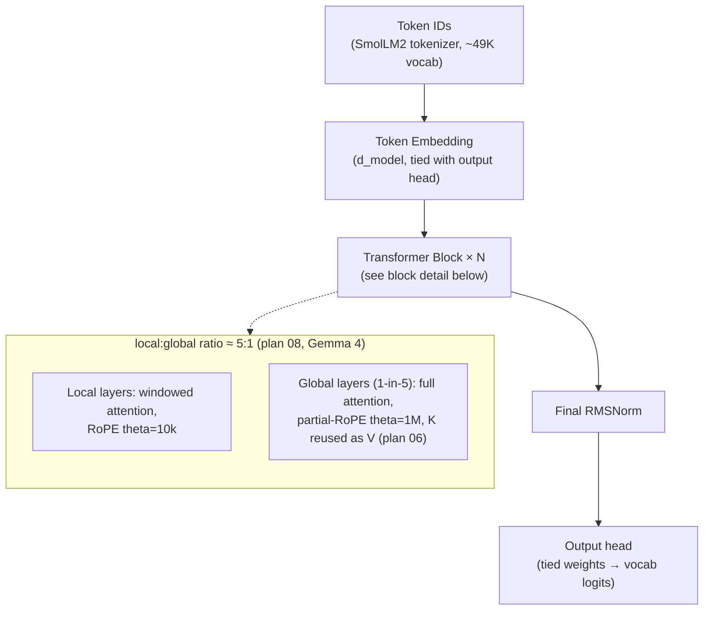
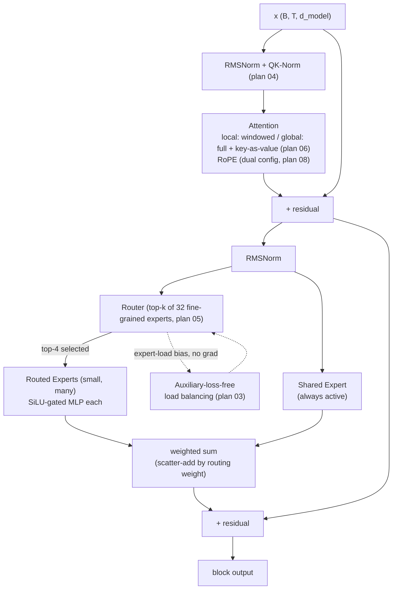

# Malvinas — architecture (proposed)

Reflects the techniques favored in `docs/plans/` so far, not the full menu of
alternatives (e.g. GQA and key-value-reuse both solve the same problem —
this picks one). Nothing here is executed yet; this is the target shape.

## Full stack

## One Transformer block

## Notes

- **Attention**: 5-in-6 layers are local/windowed (cheap, short RoPE theta);
  the rest are global/full-attention with key-as-value reuse instead of a
  separate V projection, and a partial-rotary, high-theta RoPE for long-range
  reach (plan 08 + 06, both Gemma 4).
- **MoE FFN**: many small experts (fine-grained, plan 05) instead of few big
  ones, top-k routed, plus one always-on shared expert (DeepSeekMoE
  pattern) — router is kept balanced via a dynamic per-expert bias updated
  outside the gradient graph (plan 03, DeepSeek-V3), not an auxiliary loss
  term (plan 02 is the fallback if 03 turns out harder to get right in
  practice).
- **Not pictured**: GQA (plan 07) and MLA (plan 10) are alternatives to the
  key-value-reuse approach shown here, not additions to it — pick one path,
  not all three. Same for MTP (plan 09), Kimi Delta Attention (plan 11), and
  MoBA (plan 12) — later-stage options, not part of this first target shape.
